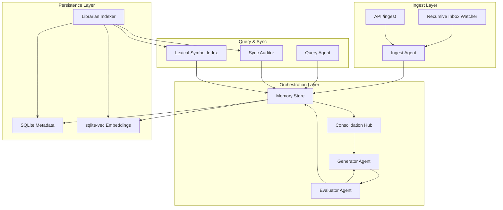

# AOM Architecture

This document provides a high-level overview of the Always-On-Memory (AOM) v3 system, its core components, and the data flow between them.

## 🧱 Component Diagram

## 🔄 Core Data Flow

### 1. Ingestion
- **Source**: Files or nested folders dropped into the `inbox/` directory or direct POST requests to `/ingest`.
- **Process**: The **Recursive Inbox Watcher** verifies content hashes. The **Ingest Agent** analyzes the content (text, image, audio, or PDF), extracts entities and topics, and assigns an importance score.
- **Semantic Invalidation**: If an existing file is updated, prior related memories are immediately marked as superseded (their `valid_to` set to current time) and their links marked as `historical_trace`, cleanly preventing context rot.
- **Outcome**: A new `MemCube` is persisted in the database with its vector embedding.

### 2. Adversarial Consolidation
- **Trigger**: Periodically (every 30m) or via the **AutoDream** idle-time routine.
- **Process**: Unconsolidated memories are grouped. The **Generator Agent** creates a synthesis. The **Evaluator Agent** rigorously grades it for fidelity and completeness.
- **Outcome**: If the grade is high enough, a new **Insight MemCube** is created, and the source memories are marked as `consolidated`.

### 3. Structural Linkage (Self-Healing)
- **Watcher**: The **Librarian** monitors the project's source code.
- **Drift Detection**: If a code change is detected, the Librarian compares the new code embedding against linked memories.
- **Self-Healing**: Significant drift triggers the **Sync Auditor**, which updates the link status (ACTIVE, REPAIR, or HISTORICAL) and can trigger a memory repair if the implementation has diverged from the memory's description.

### 4. Query & Recall
- **Trigger**: User question via the REST API, MCP tool call, or another agent.
- **Process**: The **Query Agent** performs a hybrid search (semantic vector search + relational metadata) to retrieve the most relevant `MemCubes`.
- **Lexical Navigation**: The **Lexical Symbol Index (LSI)** provides instant, exact-match code navigation by indexing class and function signatures.
- **Outcome**: A grounded answer synthesized from actual project history and linked source files.

## 🛠️ Key Technologies
- **PydanticAI**: Agent orchestration and structured result validation.
- **SQLite + sqlite-vec**: Unified storage for metadata and high-performance vectors.
- **TurboQuant**: 3.5-bit vector compression for efficient long-term storage.
- **FastMCP**: High-performance Model Context Protocol (MCP) server for tool-based agent interaction.
- **Aiohttp**: Asynchronous HTTP (REST) API layer.
